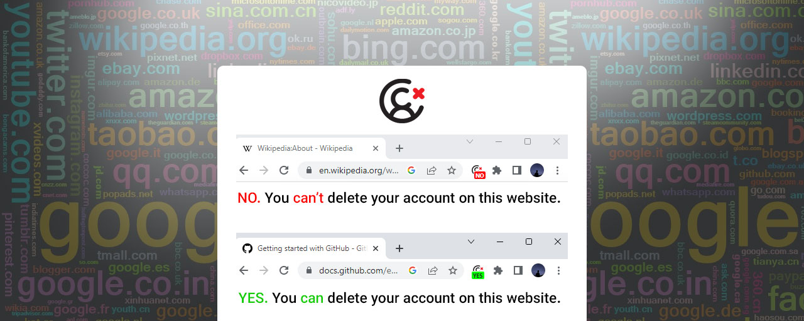

# Delete Friendly - Chrome extension

Usually, the story goes like this:

We decide to delete our account on a website. We search for delete account, deactivate account, danger area, etc, but nothing are there! We blame ourselves for sign up to such a website. Even if we have the time and patience to follow up, it still annoys us! Such a website has violated our freedom and is not a delete friendly!

**Delete Friendly** is a chrome extension to let you know whether or not a website allows you to delete your account (easily) without any extra steps like contact with customer support, waiting for confirmation, asking money, or any other ifs and buts. 

Simply put, any website which allows you to delete your account with just *one click and bang* is considered as a delete friendly. This helps you think twice before registering for a website.

## Installation
1. [Download the extension](https://github.com/sir-kokabi/delete-friendly/archive/refs/heads/main.zip) and extract zip on the desktop.
2. Open chrome extensions panel by visiting `chrome://extensions`.
3. Turn `developer mode` on.
4. Drag `src` folder into extensions panel.
5. Now whenever you want to signup in a website ,take a look at the extension. If it says **YES** with a green background, you can safely signup for that website because you can delete your account at any time. If it says **No** with a red background, you should think twice. You might want to signup using a temporary email address!

## Contribution
You can help contribute by using the extension, [adding new websites](data), report or modify reported websites, finding bugs, opening issues, offering new feathers. 

Pull requests are also appreciated!

## Donation
- **Bitcoin:** 1LUbbaAGKFkaSXgDhD4AAc8i2kipW6Qh2R
- **ETH:** 0xaEC3571C6207B05A41Ab35b40a4B6DF04A072450

## Resources
- https://github.com/justdeleteme/justdelete.me
- https://github.com/rtbf-ir/rtbf.ir
